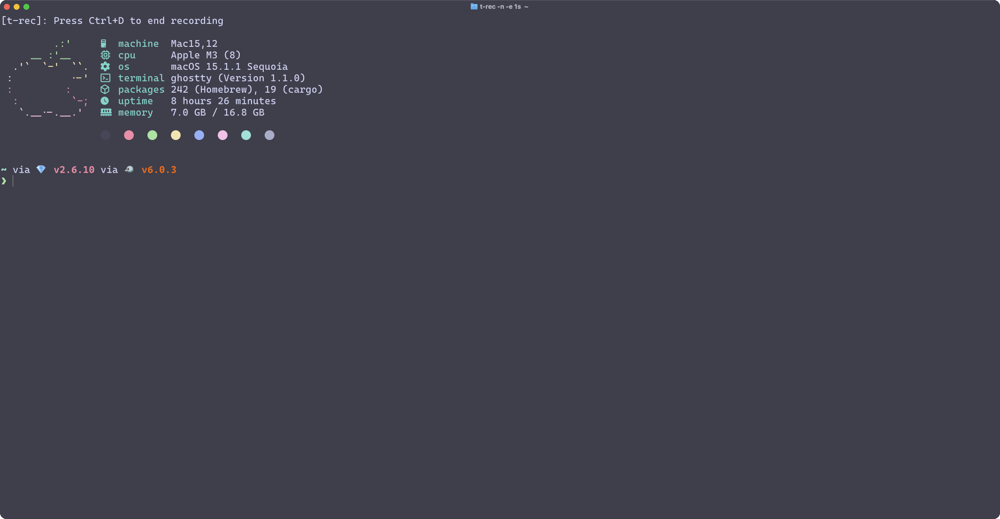

# httpie-oapi

A command-line tool that enhances HTTPie with OpenAPI specification support, providing intelligent command-line completion and API documentation integration.

## Features

- 🔍 Smart command-line completion for OpenAPI endpoints
- 📚 Automatic API documentation integration
- 🚀 Seamless integration with HTTPie
- 🐟 Fish shell completion support
- 🔄 Automatic API specification caching

## Demo



Watch httpie-oapi in action! The demo shows how to add an OpenAPI specification, explore available endpoints with smart completion, and execute API requests seamlessly.

## TODO Features

- [ ] Support for multiple OpenAPI specification formats (YAML, JSON)
- [ ] Support for OpenAPI $ref references
- [x] Fish shell completion support
- [ ] Zsh shell completion support
- [ ] Bash shell completion support
- [ ] Interactive mode for API exploration
- [ ] Support for API authentication methods
- [ ] Request/response validation against OpenAPI schema
- [ ] Support for environment variables in API specifications
- [ ] API documentation generation in markdown format
- [ ] Support for API versioning
- [ ] Rate limiting and request throttling

## Installation

```bash
cargo install httpie-oapi
```

## Usage

### Basic Commands

```bash
# List all registered APIs
httpie-oapi spec list

# Add a new API specification
httpie-oapi spec add petstore https://petstore3.swagger.io/api/v3/openapi.json -b https://petstore3.swagger.io/api/v3

# Refresh API specification cache
httpie-oapi spec refresh petstore

# Remove an API specification
httpie-oapi spec remove petstore
```

### Fish Shell Integration

Generate fish shell completion:

```bash
httpie-oapi completions --shell fish --output ~/.config/fish/completions/httpie-oapi.fish
```

## Configuration

The tool stores API specifications and configuration in:
- `~/.config/httpie-oapi/config.toml` - Configuration file
- `~/.local/state/httpie-oapi/` - API specification cache


## License

MIT License 